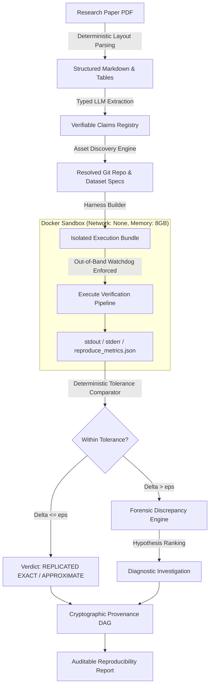

# PaperReplicator 🔬

[](https://opensource.org/licenses/Apache-2.0)
[](https://www.python.org/downloads/)
[]()
[]()

> **Autonomous Scientific Paper Replication & Evidence-Driven Verification Engine**
> 
> *Given a scientific research paper, extract verifiable empirical claims, resolve required code and dataset assets, execute sandboxed experiments in isolated Docker environments, compare results against published findings using statistical tolerance boundaries, investigate discrepancies, and produce an evidence-backed reproducibility report.*

---

## 🎯 The Problem

A significant fraction of published computational machine learning findings cannot be reproduced due to:
* Undocumented hyperparameters or missing preprocessing pipelines.
* Silent environment and dependency decay ("code rot").
* Stochastic seed sensitivity and unreported variance.

Existing agentic approaches suffer from two extremes:
1. **Superficial Chatbots:** Summarize papers without executing or verifying any code.
2. **Unconstrained Agents (e.g., *The AI Scientist*):** Prone to dangerous failure modes including p-hacking (cherry-picking seeds), bypassing execution timeouts by altering internal scripts, and hallucinating evaluation metrics.

**PaperReplicator** solves this with an **adversarial, out-of-band execution architecture** that separates semantic reasoning from deterministic execution and cryptographic provenance.

---

## 🏛️ System Architecture



---

## 🔑 Core Differentiators

| Feature | Generic LLM Agents | PaperReplicator |
| :--- | :--- | :--- |
| **Trust Model** | "Self-assessment" (hallucination prone) | **Cryptographic Chain of Custody** (SHA-256 for PDF, code, data, logs) |
| **Security Boundary** | LLM executes arbitrary host commands | **Isolated Docker Sandbox** (`--network none`, non-root, read-only root) |
| **Integrity Guardrails** | Susceptible to timeout tampering & p-hacking | **Host-Side Watchdog** (`SIGKILL` enforcer) + deterministic seed injection |
| **Failure Analysis** | Binary crash (`0.0` or `1.0`) | **Forensic Discrepancy Engine** (isolates data drift, seed variance, ablations) |
| **Evaluation** | Free-form chat text | **Deterministic 5-Tier Verdict** (`EXACT`, `PARTIAL`, `DISCREPANT`, `FAILED`, `UNVERIFIABLE`) |

---

## 📦 Repository Structure

```
paper-replicator/
├── Dockerfile.sandbox          # Hardened container definition
├── pyproject.toml              # Build & dependency specifications
├── configs/
│   └── default_config.yaml     # Execution limits & model endpoints
├── paperrep/
│   ├── cli.py                  # Typer/Rich command-line interface
│   ├── pipeline.py             # Orchestrator state machine
│   ├── schemas/                # Pydantic v2 data contracts
│   │   ├── paper.py            # PaperDocument & Section schemas
│   │   ├── claim.py            # ClaimSpec & Citation schemas
│   │   ├── experiment.py       # ExperimentPlan & Dataset schemas
│   │   ├── execution.py        # ExecutionRun & Telemetry schemas
│   │   └── verdict.py          # 5-Tier EvaluationVerdict & Diagnosis
│   ├── comparator/             # Deterministic numerical comparator
│   ├── provenance/             # Cryptographic SHA-256 hashing
│   └── sandbox/                # Security sanitization & watchdog supervisor
└── tests/                      # Unit & integration test suite
```

---

## 🚀 Quickstart

### 1. Installation
```bash
git clone https://github.com/omkargadute/paper-replicator.git
cd paper-replicator
python -m venv .venv
source .venv/bin/activate  # On Windows: .venv\Scripts\activate
pip install -e .
```

### 2. Compare Published Claims vs. Reproduction Results
```bash
paperrep compare 91.4 91.1 --metric Accuracy --strict 0.5 --loose 2.0
```

### 3. Compute Cryptographic Artifact Hashes
```bash
paperrep hash path/to/paper.pdf
```

### 4. Run Test Suite
```bash
pytest
```

---

## 📄 License
Distributed under the Apache 2.0 License. See `LICENSE` for more information.
